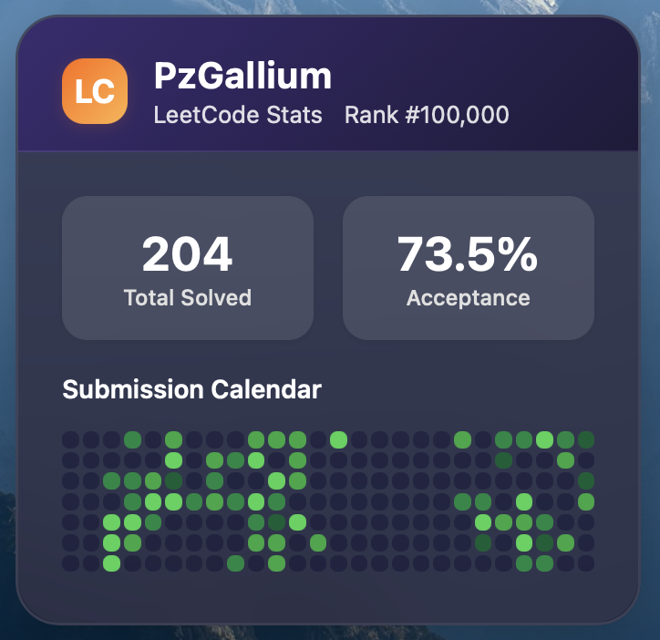

<p align="center">
  
</p>

# LeetCode Glance — 力扣桌面组件

A desktop widget for [Übersicht](https://tracesof.net/uebersicht/) that displays your **LeetCode China (力扣中国站 leetcode.cn)** stats on macOS.

在 macOS 桌面通过 Übersicht 显示你的**力扣中国站 (leetcode.cn)** 做题统计。

---

**语言 / Language:** [English](#en) | [中文](#zh)

---

<a id="en"></a>

## English

### Overview

A desktop widget for [Übersicht](https://tracesof.net/uebersicht/) that displays your **LeetCode China (力扣中国站 leetcode.cn)** stats on macOS: total solved, acceptance rate (when available), and submission calendar.

### Installation

1. **Install Übersicht**  
   If you don't have it, download it from [tracesof.net/uebersicht](https://tracesof.net/uebersicht).

2. **Open Widgets Folder**  
   In the Übersicht menu bar, click **Open Widgets Folder**.

3. **Download**  
   Download this repository as a ZIP file and unzip it.  
   (Or clone: `git clone https://github.com/YOUR_USERNAME/leetcode-glance-widget.git`)

4. **Move files into Widgets Folder**  
   Copy **all contents** of the unzipped folder (`leetcode-glance.jsx`, `lc-scripts/`, `package.json`) into your Übersicht Widgets Folder.  
   (You can also move the entire unzipped folder there so that the Widgets Folder contains a subfolder named `leetcode-glance-widget` with these files inside.)

5. **Install dependencies (for 力扣中国站)**  
   Open Terminal and run:
   ```bash
   cd "$HOME/Library/Application Support/Übersicht/widgets"
   npm install
   ```

6. **Configure**  
   Open `leetcode-glance.jsx` and set:
   - `USE_LEETCODE_CN = true` for 力扣中国站, or `false` for leetcode.com.
   - `LEETCODE_USERNAME` to your LeetCode (or 力扣) username.

7. The widget should now appear on your desktop. Refresh from the Übersicht menu if needed.

### Full-year calendar (optional)

If you use **LeetCode China** and want the **full-year** submission calendar, you need to provide your login cookie.  
See `lc-scripts/README-日历.md` for steps (cookie file `.leetcode_cn_session` in `lc-scripts/`).

### Moving the widget

In `leetcode-glance.jsx`, edit the `top` and `left` values under the **POSITIONING** comment to move the widget (e.g. top-right, bottom-left).

### Features

| Feature        | Description                                                                 |
|----------------|-----------------------------------------------------------------------------|
| Total Solved   | Shows total number of accepted problems on 力扣/LeetCode.                   |
| Acceptance     | Shown when submission data is available; hidden when there is no data.     |
| Calendar       | Daily submission heatmap; full-year when cookie is set for China site.     |

### License

Use and modify freely.

---

<a id="zh"></a>

## 中文

### 简介

在 macOS 桌面通过 Übersicht 显示你的**力扣中国站 (leetcode.cn)** 做题统计：总题数、通过率（有数据时）与提交日历。

### 安装

1. **安装 Übersicht**  
   若尚未安装，请从 [tracesof.net/uebersicht](https://tracesof.net/uebersicht) 下载并安装。

2. **打开组件目录**  
   点击菜单栏中的 Übersicht 图标，选择 **Open Widgets Folder（打开组件文件夹）**。

3. **下载**  
   下载本仓库 ZIP 并解压（或执行 `git clone https://github.com/YOUR_USERNAME/leetcode-glance-widget.git`）。

4. **放入组件**  
   将解压后的文件夹里的**所有内容**（`leetcode-glance.jsx`、`lc-scripts/`、`package.json`）复制到刚打开的 Widgets 文件夹中。  
   （也可以把整个解压后的文件夹移进去，让 Widgets 文件夹里有一个名为 `leetcode-glance-widget` 的子文件夹，里面是这些文件。）

5. **安装依赖（使用力扣中国站时）**  
   打开终端，执行：
   ```bash
   cd "$HOME/Library/Application Support/Übersicht/widgets"
   npm install
   ```

6. **配置**  
   用文本编辑器打开 `leetcode-glance.jsx`，修改：
   - `USE_LEETCODE_CN = true` 表示使用力扣中国站，`false` 表示英文站 leetcode.com。
   - `LEETCODE_USERNAME` 改成你的力扣（或 LeetCode）用户名。

7. 保存后，组件会出现在桌面上；如未出现，可在 Übersicht 菜单中刷新。

### 全年提交日历（可选）

若使用**力扣中国站**且希望组件显示**全年**提交热力图，需要提供登录 Cookie。  
说明与步骤见：`lc-scripts/README-日历.md`。

### 移动组件位置

在 `leetcode-glance.jsx` 中找到 **POSITIONING** 注释下的 `top` / `left`，修改即可改变组件在屏幕上的位置。

### 功能说明

| 功能         | 说明                                             |
|--------------|--------------------------------------------------|
| 总题数       | 显示在力扣/LeetCode 上已通过的题目总数。         |
| 通过率       | 有提交数据时显示；无数据时不显示该块。           |
| 提交日历     | 按日的提交热力图；中国站配置 Cookie 后可显示全年。|

### 许可

可自由使用与修改。
